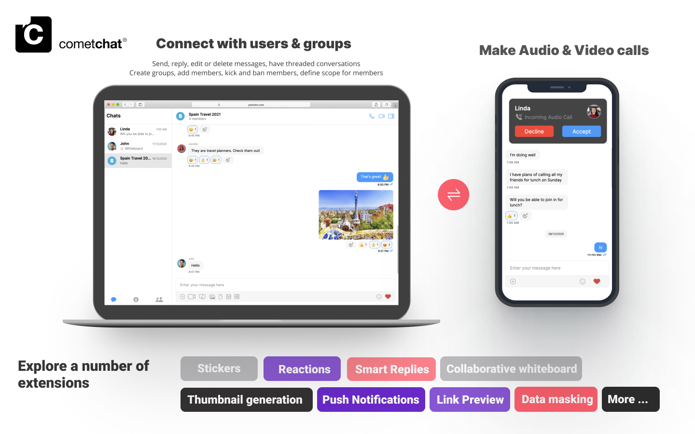
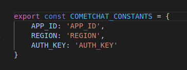

CometChat Sample App (built using **CometChat UI Kit**) is a fully functional real-time messaging app capable of private (one-on-one), group messaging, voice & video calling.

# Building and Running Docker Container for React App

This Ansible playbook can be used to build and run a Docker container for a React app. It includes the following tasks:

- Update apt cache
- Upgrade packages
- Install pip for Docker SDK
- Install Docker SDK for Python
- Clone the repository
- Download Node.js binary package
- Extract Node.js binary package
- Add Node.js binary to PATH
- Verify Node.js installation
- Install React
- Install React Scripts
- Install Node Sass
- Install openssl
- Copy Dockerfile to the webserver
- Build Docker image
- Run Docker container

## Requirements

- Ansible installed on your system.
- Docker and Docker SDK for Python should be installed on the webserver.
- A React app repository should be available at https://git.cloudavise.com/visops/t056/sample-chatapp.git.

## Usage

1. Clone this repository on your local system.
2. Open the terminal and navigate to the directory where you cloned the repository.
3. Replace `APP_ID`, `REGION` and `AUTH_KEY` with your CometChat `App ID`, `Region` and `Auth Key` in src/consts.js file.



4. Update the hosts in chat.yaml with the IP address of your webserver.
5. Run the playbook using the following command:

    ```
    ansible-playbook chat.yaml
    ```

Once the playbook execution is completed, the React app will be running on the webserver at http://<webserver-ip>:3000.

